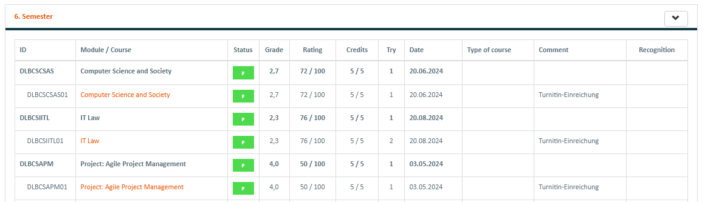
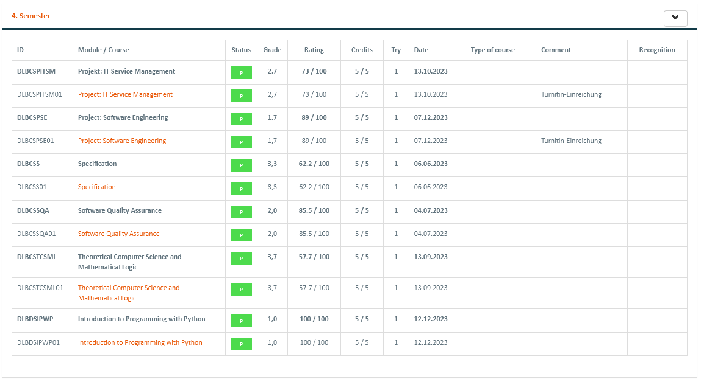

## Bachelor of Computer Science at [International University of Applied Sciences](https://www.iu.org/bachelor/computer-science)

Diploma: [jpg](https://github.com/Wolfram-180/Bachelor-Computer-Science/blob/main/diploma.jpg)

Bachelor Thesis: [PDF](https://github.com/Wolfram-180/Bachelor-Computer-Science/blob/main/20250326_Ulvis_Sergei_32113004_bachelor_thesis_nopers.pdf)

Thesis source code: [link](https://github.com/Wolfram-180/iu_bachelor_thesis)

Colloquium defense: [PDF](https://github.com/Wolfram-180/Bachelor-Computer-Science/blob/main/Colloquium_080425_nopers.pdf)

Effectives A - B passed:

Semester 6 - all passed:

Semester 5 - all passed:

Semester 4 - all passed:
  

Semester 3 - all passed:

Semester 2 - all passed:

Semester 1 - all passed:

